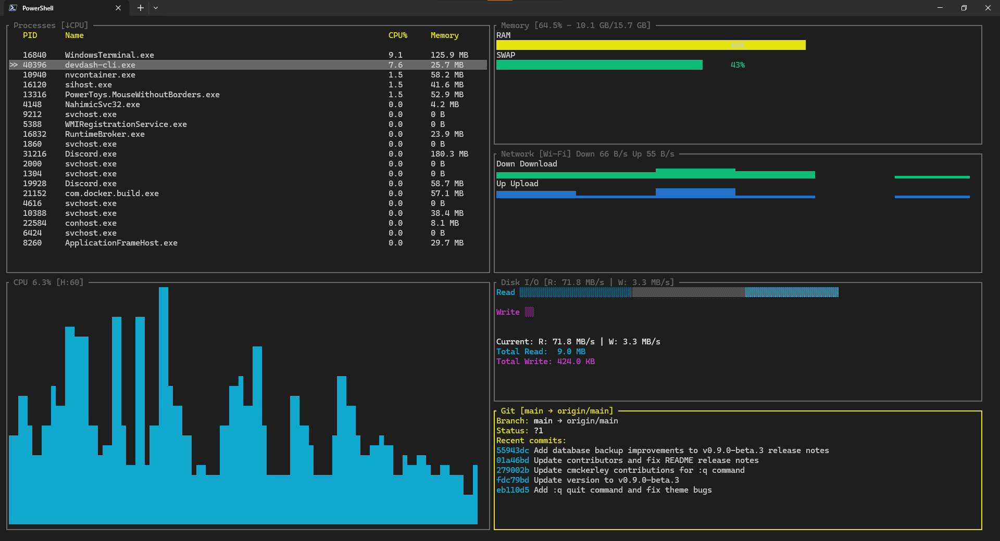

# devdash

A terminal-based dashboard for developers built with Rust and Ratatui. devdash provides real-time system monitoring with a flexible layout system and plugin architecture.



## Features

- **6 Built-in Widgets**: CPU, Memory, Disk, Process, Network, and Git monitoring
- **Flexible Layout System**: Horizontal and vertical layouts with flex constraints
- **Plugin Architecture**: Extend functionality with custom widgets
- **Hot Reload**: Live configuration and plugin updates
- **Multiple Dashboards**: Switch between different widget arrangements

## Installation

```bash
git clone https://github.com/Cod-e-Codes/devdash
cd devdash
cargo build --release
```

## Usage

Run devdash with the default dashboard:
```bash
cargo run
```

Select a specific dashboard:
```bash
cargo run -- --dashboard=dev
```

Available dashboards: `default`, `minimal`, `process-focused`, `dev`, `dev-optimized`

### Keyboard Shortcuts

- `Q` - Quit application
- `Tab` - Switch focus between widgets
- `Ctrl+R` - Reload configuration

## Configuration

devdash uses `devdash.toml` for configuration. Define multiple dashboards with different widget layouts:

```toml
[[dashboard]]
name = "default"

  [dashboard.layout]
  type = "layout"
  direction = "horizontal"
  
  [[dashboard.layout.items]]
  type = "widget"
  name = "process"
  flex = 2
```

### Layout Constraints

- `flex = N` - Proportional sizing (higher = more space)
- `percentage = N` - Percentage of available space (0-100)
- `fixed = N` - Fixed size in characters

## Widgets

### CPU Widget
Displays system CPU usage and load averages with real-time updates.

### Memory Widget
Shows RAM usage, available memory, and memory pressure metrics.

**Controls:**
- `U` - Cycle through display units (Auto/B/KB/MB/GB/TB)
- `S` - Toggle swap visibility
- `R` - Force refresh

### Disk Widget
Monitors disk usage, I/O rates, and storage statistics across all mounted filesystems.

**Controls:**
- `T` - Toggle between I/O stats and usage views
- `D` - Cycle through disks in usage view
- `H` - Toggle history length (30/60/120 samples)
- `R` - Reset I/O history
- `↑/↓` or `K/J` - Navigate disk list

### Process Widget
Interactive process list with sorting capabilities and real-time CPU/memory usage.

**Controls:**
- `C` - Sort by CPU usage
- `M` - Sort by memory usage
- `N` - Sort by process name
- `↑/↓` or `K/J` - Navigate process list

### Network Widget
Network interface statistics including bytes sent/received and connection status.

**Controls:**
- `T` - Toggle between I/O stats and interface usage views
- `↑/↓` or `K/J` - Navigate interface list (in usage view)
- `R` - Reset current totals

### Git Widget
Repository status display showing current branch, commits ahead/behind, and recent commit history.

**Controls:**
- `G` - Open repository in file manager
- `R` - Force refresh

## Layout System

devdash supports nested horizontal and vertical layouts:

- **Horizontal**: Widgets arranged side-by-side
- **Vertical**: Widgets stacked top-to-bottom
- **Nested**: Combine layouts for complex arrangements
- **Flex Constraints**: Distribute space proportionally between widgets

Example nested layout:
```toml
[[dashboard.layout.items]]
type = "layout"
direction = "vertical"
  [[dashboard.layout.items.items]]
  type = "widget"
  name = "cpu"
  flex = 1
```

## Plugin System

Create custom widgets using the devdash Plugin SDK:

```rust
use devdash_plugin_sdk::*;

struct MyWidget {
    // Your widget state
}

impl Widget for MyWidget {
    fn render(&mut self, area: Rect, buf: &mut Buffer) {
        // Your rendering logic
    }
    // ... implement other required methods
}

export_plugin!(MyWidget, "my_widget");
```

Build and install plugins:
```bash
cd examples/example_plugin
cargo build --release
cp target/release/example_plugin.dll ~/.devdash/plugins/
```

Plugin directory: `~/.devdash/plugins/`

## Hot Reload

- **Configuration**: Press `Ctrl+R` to reload `devdash.toml` without restarting
- **Plugins**: Automatic detection and reloading of plugin changes
- **Widgets**: Live updates when configuration changes

## License

MIT License
